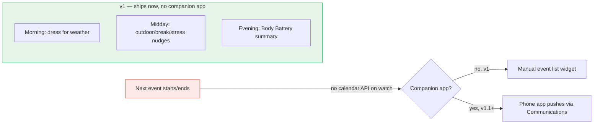
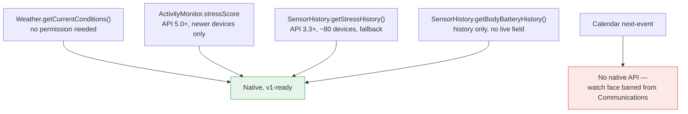
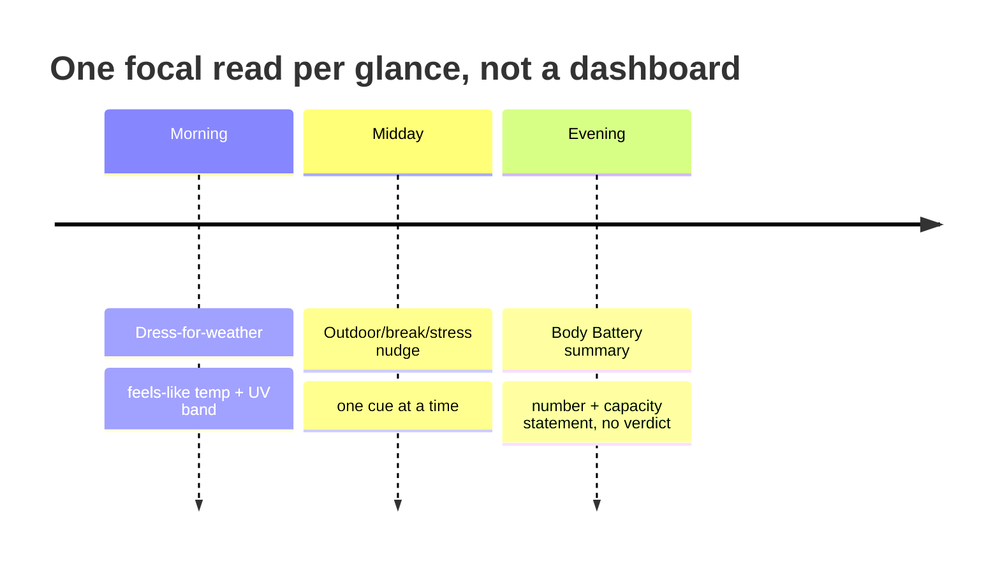
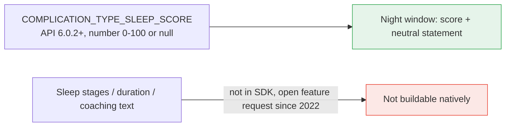
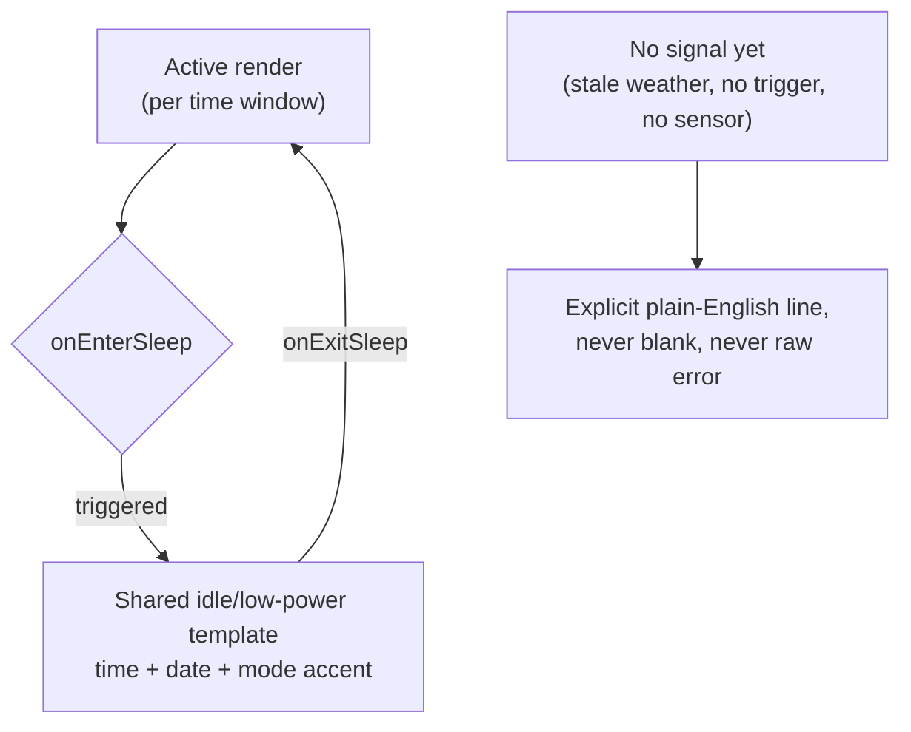

# Ship the day face, defer the calendar

Four of this concept's five guidance moments — dress-for-weather, good-weather nudges, break/walk timing, stress-reset prompts, and the evening Body Battery summary — run entirely on data Connect IQ already exposes on-device, with no companion app and no store-review risk beyond the ordinary. The fifth, "next event starts/ends," cannot be built at all with a native Connect IQ API: Garmin ships no calendar API, and a Garmin forum reply is unambiguous that a watch face is barred from any phone communication whatsoever, so calendar awareness can only reach the watch through a phone-side companion app pushing data into a **widget**, never the face itself ([Garmin Forums](https://forums.garmin.com/developer/connect-iq/f/app-ideas/280141/calendar-api)). That one gap reshapes the whole plan: the recommended v1 ships the full day-arc experience on the watch face using only weather, activity-monitor, and sensor-history data, launches the calendar piece as a widget-only feature behind a companion app the studio has never had to build before, and treats "defer calendar to v1.1" as the safer default given the studio's one-developer scale. Competitively, this is unclaimed ground — no Connect IQ, Wear OS, or Apple Watch product switches its own displayed content by time of day the way this concept proposes — but the studio's own prior Body Battery ADR (TwoSuns ADR-008, "no verdicts on Body Battery") already establishes the exact wording discipline this new app needs, so the craft bar and the copy voice are largely solved problems, not open ones. Recommended name is **DayArc**, recommended price is the studio's existing $1.99 tier, and the biggest open items before spec.md are a real-browser read of two JS-rendered Garmin pages and one human call on whether a phone companion app is in scope at all for v1.

## Weather, stress, and Body Battery are free; the calendar is not

`Toybox.Weather.getCurrentConditions()` returns temperature, feels-like temperature, precipitation chance, UV index, wind speed/bearing, humidity, and cloud cover straight from the device's own cache, with **no manifest permission required** for any of those fields — only the separate observation-location fields need `Positioning`, and the morning dress-for-weather feature doesn't need those ([Toybox.Weather.CurrentConditions](https://developer.garmin.com/connect-iq/api-docs/Toybox/Weather/CurrentConditions.html)). The catch is that there is no app-triggered refresh call: the API only reads whatever the device last synced, so freshness rides entirely on the device's own phone/GPS-linked sync schedule, which is undocumented at the interval level. Evening Body Battery is available only as history — `SensorHistory.getBodyBatteryHistory()`, not a live field in `ActivityMonitor.Info` — while stress has a two-tier reality: a live `stressScore` field exists but requires API 5.0.0 and is limited to newer models (fēnix 7-series+, Forerunner 165+, Venu 2+), so broader devices fall back to `SensorHistory.getStressHistory()` (API 3.3.0, ~80+ devices) ([Toybox.ActivityMonitor.Info](https://developer.garmin.com/connect-iq/api-docs/Toybox/ActivityMonitor/Info.html); [Toybox.SensorHistory](https://developer.garmin.com/connect-iq/api-docs/Toybox/SensorHistory.html)). Given the brief's target of round AMOLED **and** MIP, touch **and** 5-button "from v1," the app must design for the history-only fallback everywhere and treat the live stress score as a bonus on newer hardware, not a baseline dependency.

Calendar data is the one piece with no on-device path at all. A Garmin staff-adjacent forum thread states flatly that a watch face "can't do it," and frames a real calendar API as a standing feature request the platform has never shipped ([Garmin Forums: Calendar API](https://forums.garmin.com/developer/connect-iq/f/app-ideas/280141/calendar-api)). The only working architecture is Garmin's own "Glance" showcase pattern: a phone-side companion app reads the OS calendar and pushes the next-event payload to the watch via `Toybox.Communications` phone-app messaging, landing in a widget or device app, with a temporal-event background service (capped at one wake per 5 minutes, no exceptions, per a Garmin employee reply) polling the stored payload between pushes ([Garmin Forums: Background => Temporal Event](https://forums.garmin.com/developer/connect-iq/f/discussion/5443/background-temporal-event); [Toybox.Communications.PhoneAppMessage](https://developer.garmin.com/connect-iq/api-docs/Toybox/Communications/PhoneAppMessage.html)). That means calendar awareness requires building and maintaining an Android **and** iOS companion app — a category of engineering this studio has not previously taken on for HeroSet, HeroFace, DaysToGo, or TwoSuns — plus living with a documented pain point: a forum thread titled "Permissions problem using Toybox.Communications" flags Communications-permission friction as a live, unresolved issue on the platform ([Garmin Forums](https://forums.garmin.com/developer/connect-iq/f/discussion/260809/permissions-problem-using-toybox-communications)). Whether the next-event value could ever be *re-surfaced* directly on the always-on face via Garmin's Complications system (rather than staying confined to the widget) is undetermined — the canonical Complications core-topics page never rendered past its navigation shell during this research pass, so it is an open item, not a ruled-out one.

The 5-minute background floor is not a binding constraint on the morning/midday/evening transitions themselves — those are hours apart — but it does rule out any fine-grained on-screen countdown driven by repeated background wakes; a "next event in N minutes" or break-timer tick has to be computed from a stored target timestamp and redrawn on the device's own normal `onUpdate()`/`onPartialUpdate()` cycle, not pushed by the background service ([Garmin Forums: Background => Temporal Event](https://forums.garmin.com/developer/connect-iq/f/discussion/5443/background-temporal-event)). On AMOLED burn-in, the number this studio has been carrying — "no pixel lit for more than ~4 minutes" — does not trace to any official Garmin page in this pass; the community figure that actually recurs across forum threads is **3 minutes**, and even that is explicitly forum tribal knowledge, not a quoted spec ([Garmin Forums: AMOLED always-on rules](https://forums.garmin.com/developer/connect-iq/f/discussion/322419/always-on-display-sleep-mode-behaviour-and-rules-on-newer-amoled-watches)). The directional guidance is safe to design against — keep static high-contrast elements small, keep total lit-pixel coverage low, pixel-shift anything wide or tall — but no specific minute count should be asserted as a Garmin fact in DESIGN.md until someone reads the actual FAQ page in a real browser.

## No competitor switches content by time of day — this is genuinely unclaimed

Across Connect IQ, Wear OS, and Apple Watch, the closest thing to this concept's core mechanic is **watchOS Shortcuts automation**, which lets a user manually build two separate faces and schedule an OS-level swap between them at a fixed time — a coarse, two-face workaround, not a single face with its own adaptive logic ([MacRumors](https://www.macrumors.com/how-to/change-apple-watch-face-automatically-time/)). On Connect IQ specifically, the nearest real precedent is **M2**, a free watch face with 50,000+ downloads and a 4.9★ rating that lets users define multiple display "profiles" scheduled to load at sunrise/sunset/dawn/dusk-relative windows ([Connect IQ Store: M2](https://apps.garmin.com/en-US/apps/1b4e3210-8105-487b-9f3a-8d538e6fed55)) — but M2 is a manually-configured display-profile scheduler, not a face that curates *which context* (weather vs. calendar vs. energy) matters right now. For the dress-for-weather piece specifically, the only named, priced analog on any platform is Apple's **Weather Fit: What to Wear**, a subscription app ($3.99/month, $19.99/year, or $99.99 lifetime, 4.6★/3.8K ratings) whose own review pattern — outfit suggestions that run too warm, basic customization gated behind the paywall — sets a bar this app should clear by defaulting to a wearer-tunable comfort baseline and keeping core customization free ([App Store](https://apps.apple.com/us/app/weather-fit-what-to-wear/id1194408342)). Nothing found bundles dress-for-weather, event awareness, outdoor/break/stress nudges, and an evening energy summary into one listing, on any platform — this is real white space, but it also means there is no reception data, positive or negative, to learn from before shipping.

## The craft bar and the wording discipline are largely already solved in-house

The studio's stated craft bar — "one focal read, not a dashboard" — maps unusually well onto this concept's own mechanic, because the design is *sequential* rather than *simultaneous*: instead of cramming four contexts onto one screen at once, each time window replaces the prior one wholesale, so the display never needs to multiplex more than a small handful of elements at any single moment. That is the opposite of the documented "kitchen-sink" failure mode, where a peer-reviewed survey of 1,000+ real watch faces found a median of 4 complications but outliers running to 16–17, driven by unconstrained user customization once it's unlocked ([Cheng et al., arXiv 2310.16185v2](https://arxiv.org/html/2310.16185v2)). The same paper ties Connect IQ's own 64-colour-safe MIP palette directly to this discipline: a black-and-white or limited-hue face structurally "cannot use multiple categorical color encodings based on hues," meaning the hardware constraint and the craft-bar goal point the same direction rather than fighting each other. The cross-platform pattern for signaling *that* a mode changed, without animating a full re-theme, is restraint via a single reserved accent and motion applied only to the one element that changed — watchOS tinted-mode complications collapse to one system-chosen color, and Wear OS Tiles guidance is explicit: "Emphasize when updating information... Don't unexpectedly toggle between values" ([Android Developers: Tiles design principles](https://developer.android.com/design/ui/wear/guides/m2-5/surfaces/tiles-principles)). Because a Connect IQ MIP/AMOLED face has no compositor and no SwiftUI-style transition primitive, the transferable version of this is a **static swap discovered on next glance**, optionally marked by a one-time accent flash or a consistent icon change at redraw — never a rendered animation the hardware can't cheaply do.

On wording, the platform-wide pattern across Garmin, Fitbit/Google, and WHOOP is a number or band plus a capacity statement, never a mood or verdict word: Garmin's own owner's manual frames Body Battery purely as "reserve energy" via a gas-gauge metaphor with no evaluative language attached to the band ranges, and Fitbit's rebrand to a three-word "Resilience score" (Optimal/Balanced/Low) deliberately dropped the raw number rather than adding more diagnostic precision ([Garmin vívoactive 5 manual](https://www8.garmin.com/manuals/webhelp/GUID-5D183A14-BB43-4A9B-B441-5F824214CE40/EN-US/GUID-87E1392B-2C55-40B7-A1FF-3AB9252DA0A0.html); [Google Health: Resilience score](https://support.google.com/fitbit/answer/14237928)). This is not a new discovery for this studio — TwoSuns ADR-008 already commits to "no verdicts on Body Battery," and the evening summary in this new app should simply inherit that same house rule rather than re-litigate it. For the other three moments, the safe pattern is equally consistent: report a feels-like temperature and a named UV band rather than raw thresholds, since WHO itself concedes its UVI≥3 cutoff "was chosen without evidence" ([WHO](https://www.who.int/news-room/questions-and-answers/item/radiation-the-ultraviolet-(uv)-index)); describe the early-afternoon alertness dip as a population-level pattern ("a common dip in alertness") rather than a personalized diagnosis, since the underlying circadian post-lunch dip is well-evidenced but the popular 25-minute Pomodoro and 90-minute "ultradian" numbers are explicitly flagged by their own proponents as heuristics, not validated biological constants ([PubMed](https://pubmed.ncbi.nlm.nih.gov/8877121/); [ScienceBlog.com](https://scienceblog.com/t-90-minutes-work-20-minutes-recovery-not-universal-brain-cycle/)); and for stress, follow WHOOP's own model of naming multiple possible contributing factors rather than asserting a single cause, the same way its Red recovery band lists "overtraining, sickness, stress, lack of sleep, or other lifestyle factors" instead of diagnosing any one of them ([WHOOP](https://www.whoop.in/pages/how-it-works)). Garmin's own stress-tracking page gives a firmer, first-party source for the same discipline and a concrete banding to build against: stress is a 0-100 score from HR+HRV, 0-25 shown blue ("rest," parasympathetic) and 25-100 shown orange ("draining," sympathetic) — worth using as the band definition directly rather than inventing one ([Garmin: Stress Tracking](https://www.garmin.com/en-US/garmin-technology/health-science/stress-tracking/)). That page also states plainly that **Garmin does not measure stress during physical activity** — the reading is suppressed, not zero — which is a real gap this app's midday "reset your stress level" nudge has to design for explicitly: mid-workout, there is no valid stress reading to show, and that needs its own stated case ("stress isn't tracked during activity") rather than displaying a stale or default value as if it were current.

## Name, pricing, and the shape of a v1 scope cut

Of twelve candidate names checked against general web and Connect IQ store search, six collided with an existing product and one — **DayShift** — is a direct in-store collision with an existing (if low-traction) Connect IQ watch face ([Connect IQ Store: DayShift](https://apps.garmin.com/pl-PL/apps/34971426-f5ee-4e06-acf1-2ad6396f4f17)). Six came back clean: HeroDay, DayArc, Daybeat, DayCue, Daybreaker, and Guideday. The recommendation is **DayArc**: it follows the same evocative, non-descriptive naming pattern as TwoSuns and DaysToGo (says nothing literal about "adaptive guidance," the way TwoSuns says nothing literal about "sun ring plus Body Battery curve") without borrowing the "Hero-" prefix that HeroSet and HeroFace use specifically because they share the ADR-044 complication contract — this app has no such contractual tie to that pair, so naming it HeroDay would imply an ecosystem membership it doesn't have. No formal trademark-register search was run for any candidate; that gap should close before the name is locked, echoing the same unresolved item already on file from TwoSuns' own naming research.

On price, the market data consistently favors free-and-broad over paid-and-narrow for exactly this shape of product: the one direct Connect IQ precedent for time-of-day content switching, M2, is free with 50,000+ downloads and a 4.9★ rating, while every narrow single-idea paid widget found in this and prior studio research tops out in the low thousands of downloads regardless of price. Set against that is the studio's own established house pattern — TwoSuns and DaysToGo both shipped paid at $1.99 with a price review scheduled at approval+45 days — and no direct comparable exists for a product that bundles all four contexts, so this is a judgment call rather than something more research resolves. The recommendation is to hold the studio's existing $1.99 tier for consistency with the rest of the catalog and revisit at the same approval+45-day cadence already used elsewhere, rather than treating this one app as a special case.

The clearest scope decision, though, is the v1 cut itself: ship the watch face and widget combo with morning weather guidance, midday outdoor/break/stress nudges (all native-data-only, usable directly on the face), and the evening Body Battery summary — none of which need a companion app, Communications permission, or phone-side calendar access. Leave the calendar "next event" feature out of v1 entirely, or replace it with a much cheaper substitute: a manually-configured event list set through Garmin Connect Mobile's settings UI, the same pattern **Countdown!** and other Connect IQ countdown widgets already use successfully at 100,000+ downloads, with zero Communications risk ([Connect IQ Store: Countdown!](https://apps.garmin.com/en-US/apps/183a7d45-c05e-4964-ba16-8f238eab2ba6)). A true calendar-reading companion app is a legitimate v1.1/v2 feature once the rest of the product has shipped and been device-tested, not a v1 commitment for a one-developer studio taking on its first phone-side app.

## Sleep score is real; sleep coaching is not; idle states are a gap in the plan itself

A follow-up question raised two items this report didn't originally cover: a possible fifth "sleep coach" moment, and what the face shows outside its defined windows.

`Toybox.Complications.COMPLICATION_TYPE_SLEEP_SCORE` is a real, subscribable complication (API 6.0.2+) returning a raw 0-100 number or `null` ([Toybox.Complications](https://developer.garmin.com/connect-iq/api-docs/Toybox/Complications.html)). It is the only sleep-related data Connect IQ exposes: no sleep stages, no duration, no coaching or bedtime-recommendation text — a 2022 SDK feature request for exactly that data is still open and unresolved as of a 2025 repost ([Garmin Forums: feature-request add sleep data to the sdk](https://forums.garmin.com/developer/connect-iq/i/bug-reports/feature-request-add-sleep-data-to-the-sdk)). Garmin's own health-science pages confirm this is a real distinction, not just an SDK gap: "Sleep Coach" is a named, separate first-party feature — a forward-looking personal sleep-need recommendation (6.5-9.5h, from age/sleep-alignment, activity history, sleep debt/banking, naps, and HRV) — while "Sleep Score" is a backward-looking result number ([Garmin: Sleep Coach](https://www.garmin.com/en-US/garmin-technology/health-science/sleep-coach/)). The two are genuinely different features on Garmin's own site, and only the backward-looking one is exposed to third parties. So a "sleep coach suggestion" as literally asked for cannot be built — but a **sleep score** night window can, on the same terms as everything else native here: number plus a neutral capacity statement, no verdict, per the same house rule as Body Battery (TwoSuns ADR-008). API 6.0.2 is narrower than the stress score's 5.0.0 floor, so on the MIP/button devices this app targets from v1, expect it to be absent on many and design the graceful-hide/fallback path already planned for stress.

Separately, the plan as written only specifies the *active* render for each time window — it has no answer for two other real states every Connect IQ watch face must handle:

1. **Low-power/always-on render.** `onEnterSleep()`/`onPartialUpdate()` require a simplified variant of whatever is on screen, independent of which time window is active — this is an AMOLED burn-in and battery requirement, not a content decision, and none of this report's diagrams show it.
2. **No-signal/default state.** What a window shows when it has nothing to say yet (midday with no break trigger, stale weather, no sensor data) — covered in the abstract by watch-design-lead's empty-state rule, but never drawn out against this app's specific windows.

Recommendation: one shared idle/low-power template — time, date, a small mode-accent — reused across every window, rather than a per-window low-power variant (5+ windows × 2 states multiplies design surface against the restraint principle already anchoring this report). The active-window content swaps on top of that shared base; it does not each need its own dimmed twin.

This adds a sixth candidate moment (sleep score, evening/night) and one structural item (idle/low-power + empty-state template) to the open list below — neither is research-blocked, both are design/spec decisions.

## What the market actually rewards is the opposite of this app's craft bar — and that's the point

A direct look at a large no-code Garmin watch-face community site's "most downloaded" and "most starred" lists (browsed directly, September 2026) shows the top ~20 designs in both rankings are almost entirely dense multi-field dashboards — 6-12+ visible readouts per face (heart rate, battery, steps, elevation, weather, gauges), the exact kitchen-sink pattern this report's craft-bar section already cites from peer-reviewed research (282 of 1,378 surveyed faces). This is fresh, independent corroboration of that finding, not a new one — and it cuts the same direction the report already recommends: **popularity-by-download is not evidence to add fields.** It's evidence that most of the category's existing supply is noisy, and that this app's one-focal-read discipline is differentiation, not a risk. One exception stood out in the "most starred" list: a sparse large-date-plus-weather face on a **Forerunner 965** — the same device family this studio already device-tests on — the lone example of restraint getting real traction in that gallery.

Separately, several top designs are explicitly listed as two variants — a base face and a "w. AOD" (always-on-display) version sold/shared as a distinct artifact. That's informal, real-world confirmation that treating the low-power/always-on render as its own first-class design surface (not a dimmed afterthought) is already normal practice in this category — reinforcing the idle/low-power template recommendation above rather than adding a new one. Both findings are now recorded generically in `watch-design-kit/knowledge/platform-facts.md` (UX section) for reuse across future apps.

## What still needs a human call or a real device before spec.md

Several items in this research hit a wall that only a browser, a device, or the owner can clear. Two canonical Garmin pages — Complications core-topics (whether a third party can register as a complication data provider with custom values) and Manifest-and-Permissions / App-Review-Guidelines (the actual permission-to-API mapping and any explicit battery/background review criteria) — rendered only navigation shells to the fetch tool in every attempt and need a direct browser read before DESIGN.md cites anything from them as settled. The AMOLED burn-in number needs the same treatment: don't write "3 minutes" or "4 minutes" into a spec until the two candidate FAQ pages are actually read. On hardware, nobody has yet checked which target devices in the "round AMOLED + MIP, touch + 5-button" set carry API 5.0.0 (for live `stressScore`) versus only API 3.3.0 (history-only fallback) — that's a device-compatibility-matrix exercise, not a research question. Real weather-sync cadence, real sensor-history sampling interval, and real multi-mode-switch battery cost all require empirical on-device logging per the project's own house rule that simulator passing is not device proof. And three decisions are the owner's alone: whether a phone companion app is in scope for v1 at all (this report's recommendation is no), the final name pending a real trademark search, and whether to hold the $1.99 tier or go free given the absence of a true bundled comparable to price against.
